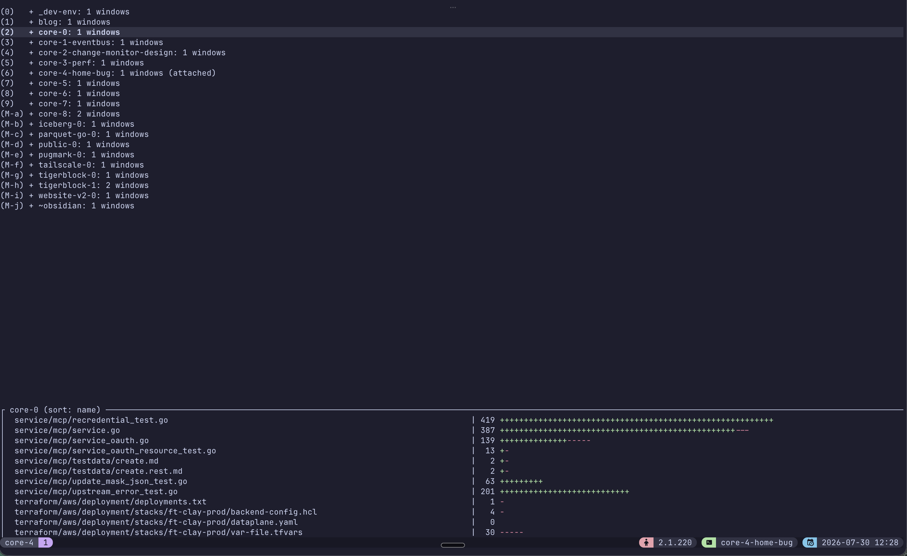
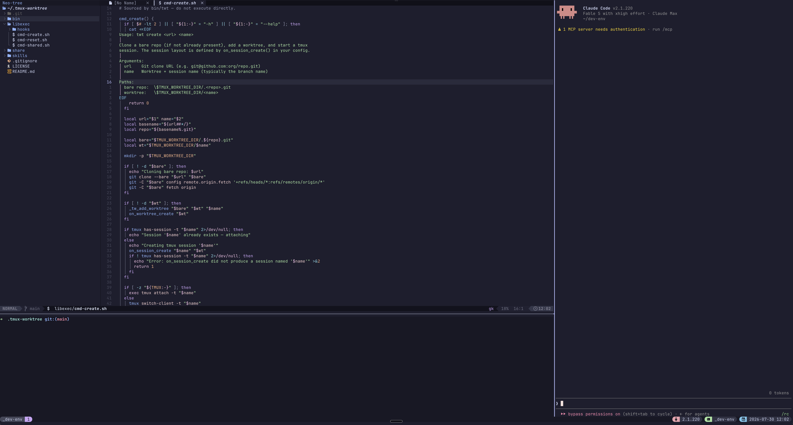

# tmux-worktree

A small tool for managing git worktrees with dedicated tmux sessions.

The repository also contains `twt2`, a Go preview that uses Projects, YAML
Project Templates, multiple repositories, and Project Agent Sessions. See the
[twt2 preview guide](docs/twt2.md).
The preview also includes a tested [Neovim plug-in](nvim/twt2.nvim/README.md)
for Project-scoped Agent selection and review feedback.

## Try the change-focused twt2 workflow

Build the preview CLI:

```sh
go build -o ./bin/twt2 ./cmd/twt2
```

Define a reusable Project Template. This example gives each change one web
repository, one API repository, and one tmux window for each repository:

```sh
twt2 templates create product
twt2 templates repos add product web git@github.com:acme/web.git
twt2 templates repos add product api git@github.com:acme/api.git
twt2 templates init set product --repo web -- ./init.sh
twt2 templates prepare product
```

Create a Project for one change:

```sh
twt2 projects create fix-auth --template product
```

`templates prepare` creates both worktrees and runs repository initialization
once. Project creation claims that ready environment and opens one tmux session
with `web` and `api` windows. twt2 prepares the next environment in the
background.

From that Project tmux session, create the next Project with one short
command:

```sh
twt2 create fix-logout
# Or run `twt2 create` and enter the name at the prompt.
```

`twt2` uses the latest saved `product` template. It completes setup, switches
your tmux client to `fix-logout`, and archives `fix-auth`. If creation or setup
fails, `fix-auth` stays active.

Register a coding-agent conversation and resume it in its own safe window:

```sh
twt2 agents register \
  --project fix-auth \
  --provider codex \
  --label auth-review \
  --session CODEX_SESSION_ID \
  -- codex resume CODEX_SESSION_ID
twt2 agents list --project fix-auth
twt2 agents resume AGENT_ID
```

Install [twt2.nvim](nvim/twt2.nvim/README.md) to select that Agent Session
with `<leader>arp`. The plug-in opens that transcript in a private
Project-specific `latest.md`. Add review notes with `<leader>an`, and send the
note batch with `<leader>arr`. One Neovim process can safely work across
different Projects. Linked transcript loading supports Codex and Claude.
Archive keeps the snapshot. Applied Project removal deletes it.

Archive the current Project when you stop its work. This keeps its worktrees,
branches, and Agent Session records:

```sh
twt2 archive
twt2 projects open fix-auth
```

When the work is complete and pushed, `twt2 finish` archives the Project and
removes its data in one step. From inside the Project session, it moves your
tmux client to another active Project first:

```sh
twt2 finish
twt2 finish fix-auth --keep
```

Inspect disk use and preview cleanup before you remove archived data:

```sh
twt2 storage show
twt2 environments list
twt2 storage clean
twt2 storage clean --apply
twt2 projects remove fix-auth
twt2 projects remove fix-auth --apply
```

See the [twt2 preview guide](docs/twt2.md) for YAML, JSON, retry, and safety
details.

Each worktree lives at `$TMUX_WORKTREE_DIR/<name>` and is backed by a shared
bare repo at `$TMUX_WORKTREE_DIR/.<repo>.git`. Each worktree gets its own tmux
session, laid out however you want.

## Install

### Manual

```sh
git clone https://github.com/jpugliesi/tmux-worktree ~/.tmux-worktree
echo 'export PATH="$HOME/.tmux-worktree/bin:$PATH"' >> ~/.zshrc
```

Update later with `git -C ~/.tmux-worktree pull`.

### twt2 preview

The Go preview needs Go 1.23 or later. Build it in the same installation:

```sh
cd ~/.tmux-worktree
go build -o ./bin/twt2 ./cmd/twt2
exec zsh
twt2 --help
```

Install shell completion for command names, Project Template names, Project
names, and Agent Session IDs with `twt2 completion zsh > "${fpath[1]}/_twt2"`.
Use `bash`, `fish`, or `powershell` for the other shells.

With lazy.nvim, load the included Neovim plug-in from the same checkout:

```lua
{
  dir = vim.fn.expand("~/.tmux-worktree/nvim/twt2.nvim"),
  config = function()
    require("twt2").setup()
  end,
}
```

After an update, run the `go build` command again. The preview does not yet
include prebuilt release files.

## Quick start

No config needed — works out of the box:

```sh
twt create git@github.com:org/repo.git feature-xyz
twt create --shallow https://github.com/org/huge-repo.git huge-0
twt create --shallow \
  --remote github=https://github.com/org/repo.git \
  https://git.example.com/org/repo.git repo-0

# From repo-0, ask to create repo-1 from the same shared repository
cd "$TMUX_WORKTREE_DIR/repo-0"
twt create
```

This clones the repo (as a bare repo under `$TMUX_WORKTREE_DIR`), creates a
worktree on a new `feature-xyz` branch, and opens a tmux session. By default
the session has one window with one pane — customize via config (below).
`--shallow` (or `--depth <n>`) does a depth-limited bare clone, useful for
large repositories; it only applies when the bare repo does not already exist.
`--remote name=url` adds extra remotes on the bare repo (repeatable); the
primary URL is always `origin`.

When you run `twt create` without arguments in a numbered workspace, `twt`
selects the next free number and asks for confirmation. It uses the same bare
repository, remotes, fetch rules, shared-file hook, and session hook. It starts
the new workspace from the repository's default branch. It does not copy the
current branch, uncommitted files, or live tmux pane processes.

Other commands:

```sh
twt start ticket-123    # create a task branch + rename the current session
twt rename review       # rename only the current tmux session
twt reset               # reset panes + hard-reset branch to origin default (silent)
twt reset -v            # same, but print per-step progress and git output
twt shared enable       # (run inside a bare repo) enable symlinked shared files
```

## Using tmux + twt with coding agents

I start tmux, then create one worktree and session per agent:

```sh
tmux
twt create --with-shared https://github.com/jpugliesi/my-repo my-repo-0
twt create https://github.com/jpugliesi/my-repo my-repo-1
twt create --with-shared https://github.com/jpugliesi/another-repo another-repo-0
```

Each repository is cloned once. Each command creates a branch, worktree, and
tmux session with the supplied name, then switches to it. I run one agent and
task per session while tmux keeps everything alive. `--with-shared` enables
shared project files before the first worktree is checked out.

Once I pick a ticket, I create its branch and rename the current session:

```sh
twt start home-bug
```

This runs `git switch -c` and renames the session from its stable slot name,
such as `core-4`, to `core-4-home-bug`. `twt` remembers the slot name so later
branch changes do not stack session names.

To change only the current tmux session name, run:

```sh
twt rename review
```

This does not rename the Git branch or worktree. The stable workspace name is
kept, so a later `twt start` or `twt reset` command can replace the manual
session name.



My `on_session_create` hook creates three panes in each session. I use them
for:

1. Neovim
2. A shell
3. A coding agent TUI



```text
/Users/jpugliesi/code/firetiger/.core.git/shared/.lazy.lua
```

That shared file customizes LazyVim for the Firetiger project and is symlinked
into all of its worktrees. See [Shared files](#shared-files-optional).

When the task is done and its work is pushed, I reset the current workspace:

```sh
twt reset
```

This restores the stable branch and session name, such as `core-4`, respawns
the other panes, and hard-resets tracked files to the origin default branch.
It does not remove untracked files.

I use [tmux-resurrect](https://github.com/tmux-plugins/tmux-resurrect) to save
and restore the sessions, windows, and pane layouts across tmux server
restarts.

## Agent skill

Install the `twt` skill for Claude Code, Codex, and other compatible agents:

```sh
npx skills add jpugliesi/tmux-worktree --skill twt
```

## Configure (optional)

Only needed if you want a custom tmux layout or a different data directory.

```sh
mkdir -p ~/.config/tmux-worktree
curl -fsSL https://raw.githubusercontent.com/jpugliesi/tmux-worktree/main/share/config.example.sh \
  > ~/.config/tmux-worktree/config.sh
```

The example ships a three-pane work window. Edit to taste.

Available knobs:

| Variable / hook | Purpose | Default |
|---|---|---|
| `TMUX_WORKTREE_DIR` | Where bare repos and worktrees live | `${XDG_DATA_HOME:-$HOME/.local/share}/tmux-worktree` |
| `on_session_create session path` | Build the tmux layout | One window, one pane |
| `on_worktree_create path` | Run after worktree is created | No-op |

## Shared files (optional)

Each bare repo can opt into a symlink-based "shared files" mechanism: any file
under `<bare>.git/shared/` is symlinked into each worktree's matching path when
the worktree is checked out. Existing non-symlink files in the worktree are
never overwritten.

Useful for:

- `.env.local`, secrets, credentials
- Editor project config (e.g. LazyVim `.lazy.lua`)
- `.rgignore`, `.claude/settings.local.json`, etc.

Enable while creating the first worktree for a repo:

```sh
twt create --with-shared git@github.com:org/repo.git repo-0
```

Or enable it later from the bare repo:

```sh
cd "$TMUX_WORKTREE_DIR/.repo.git"
twt shared enable
```

Then drop files into `shared/`. Optionally `cd shared && git init` to version
them in their own (separate) repo.

Disable with `twt shared disable`.

## License

MIT
